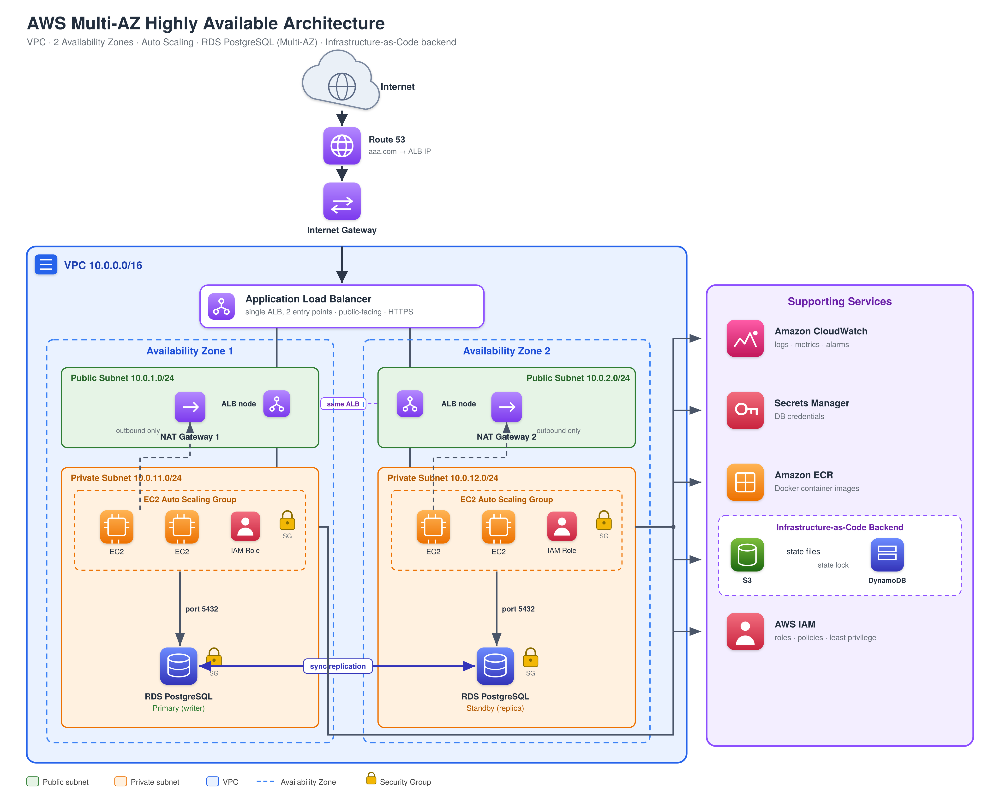

# AWS Cloud Migration

Terraform code that moves a microservices platform from on-premise to AWS.

The platform runs 8 microservices (Java/Node.js) behind an Nginx load balancer,
with a PostgreSQL database. This project recreates that setup on AWS using
Infrastructure as Code, with full CI/CD via GitHub Actions.

## Architecture



The full design document is in [`docs/architecture_document.html`](docs/architecture_document.html).

In short:

- **VPC** with 2 Availability Zones for high availability
- **ALB** (Application Load Balancer) in the public subnets, with Route 53 DNS
- **EC2 Auto Scaling Group** in the private subnets, running Docker containers
- **RDS PostgreSQL** in Multi-AZ mode, encrypted, with 7-day backups
- **IAM Roles** for both GitHub Actions (OIDC) and the EC2 instances
- **Security Groups** wired with least-privilege rules between every layer
- **Secrets Manager** holds the DB password (never in code)
- **CloudWatch** Log Groups and Alarms (CPU > 80%, ALB 5xx > 1%)

## Prerequisites

To run anything locally you need:

- **Terraform** 1.5 or newer ([download](https://developer.hashicorp.com/terraform/install))
- **Git** to clone the repo
- (optional) **AWS CLI** if you want to apply against a real account

Nothing else needs to be set up for `terraform plan` to work — the AWS provider
is configured with mock credentials and `skip_*` flags so plan runs offline.

## Running terraform plan locally

```bash
git clone https://github.com/Eytan123123/AWSdevops.git
cd AWSdevops/terraform

terraform init -backend=false
terraform plan
```

That's it. Terraform will show you everything it would create in AWS.

**Why `-backend=false`?** The project is configured to store state in S3 +
DynamoDB. Those resources don't exist yet (the project ships unapplied), so
we tell init to skip the backend setup. Once the bootstrap is done in a real
account, drop the flag.

## CI/CD pipelines

Two workflows in [`.github/workflows/`](.github/workflows):

### CI (`ci.yml`)

Runs on every push to any branch, and on every PR to `main`.

It validates the code without touching AWS:

1. `terraform fmt -check` — formatting
2. `tflint` — best practices
3. `tfsec` — security scan
4. `terraform init -backend=false`
5. `terraform validate` — config correctness
6. `terraform plan` — full plan (offline, no AWS)
7. If the run is for a PR, the plan is posted as a comment on the PR

### CD (`cd.yml`)

Runs only on push to `main` (i.e. after a PR merge).

1. Runs `terraform plan -out=tfplan`
2. Uploads the binary `tfplan` as a workflow artifact (retained 30 days)
3. Posts a readable summary on the Actions job page

CD never runs `terraform apply` — applying is left to humans, per the project spec.

### Triggering the pipelines

Just `git push`. The workflows pick it up automatically based on the trigger.

To see a run:
- Go to the repo on GitHub
- Click the **Actions** tab
- Pick a workflow on the left

## Project structure

```
AWSdevops/
├── architecture.png           # Stage 1 diagram
├── README.md                  # This file
├── docs/                      # Architecture doc + assignment PDF
├── terraform/
│   ├── main.tf                # Root: wires modules together
│   ├── variables.tf           # All configurable values
│   ├── outputs.tf             # Key resource IDs (VPC, ALB, RDS)
│   └── modules/
│       ├── vpc/               # VPC + subnets + IGW + NAT + route tables
│       ├── iam/               # OIDC + IAM Roles + SGs + Secrets Manager
│       ├── rds/               # PostgreSQL Multi-AZ
│       ├── alb/               # ALB + Target Group + Listener + Route 53
│       └── ec2/               # Launch Template + ASG + Log Groups + Alarms
└── .github/
    └── workflows/
        ├── ci.yml             # Validate, plan, comment on PR
        └── cd.yml             # Plan, archive artifact (no apply)
```

## Bootstrap (for a real deployment)

A few things must exist in AWS before this Terraform can be applied. They
break the chicken-and-egg problem of "Terraform needs AWS to create AWS":

1. **OIDC Identity Provider for GitHub** — so the CI workflow can assume an IAM Role
2. **`github-actions-terraform` IAM Role** with read-only permissions
3. **S3 bucket** `aws-migration-tfstate-eytan` for Terraform state
4. **DynamoDB table** `terraform-state-lock` for state locking

These are typically created once, manually, by an admin with their own access
keys. After that, the rest of the project runs through CI without any
long-lived credentials anywhere.

The IAM module (`terraform/modules/iam/`) contains the Terraform code for the
OIDC Provider + Role — it's not applied by CI but documents the desired shape.

## Notes

- `terraform apply` is **never** run by the pipelines. The assignment requires
  a green plan, not an actual deployment.
- The AWS provider uses mock credentials and `skip_*` flags so plan succeeds
  without contacting AWS.
- All secrets live in either AWS Secrets Manager or GitHub Actions Secrets —
  never in source code.
- All resources are tagged with `Name` and `Environment`.
